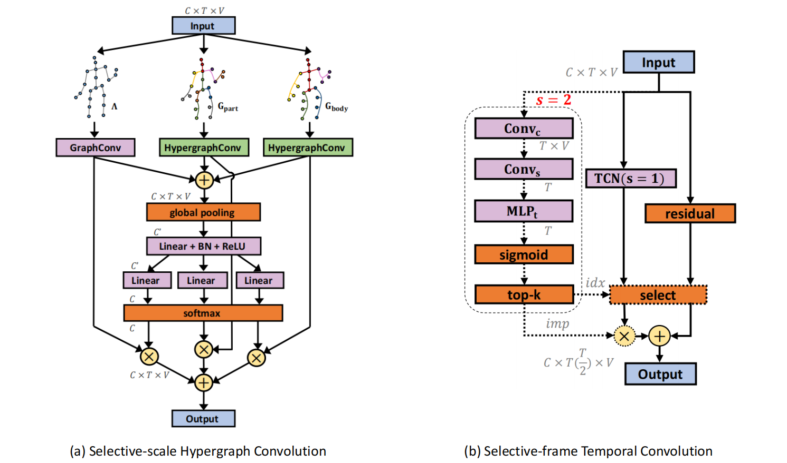
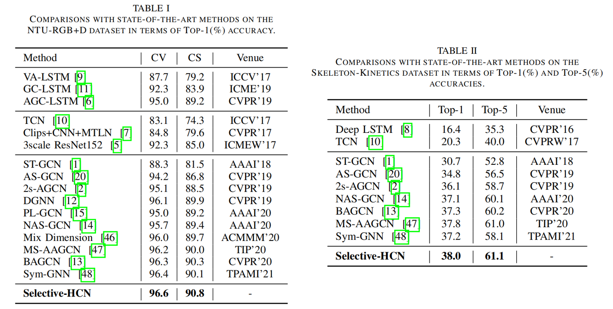
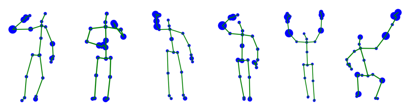

# **Selective-HCN: Selective Hypergraph Convolutional Networks for Skeleton-based Action Recognition**
This repository is the **anonymous** Pytorch implementation of the Selective-HCN method.

## Main Idea

In this work, we proposed a novel **Selective Hypergraph Convolution Network**, dubbed **Selective-HCN**, which stacks two key modules: Selective-scale Hypergraph Convolution (SHC) and Selective-frame Temporal Convolution (STC). The SHC module represents the human skeleton as the graphs and hypergraphs to fully extract multi-scale information, and selectively fuse features at various scales. Instead of traditional strided temporal convolution, the STC module can adaptively select the keyframes and filter redundant frames according to the importance of the frames.

### Insight of our Selective-HCN model

1. For one thing, we propose to represent the human body as a hypergraph in order to model higher-order correlation in the skeleton without destroying the inherent spatial position properties of the joints.
2. Furthermore, in order to aggregate skeleton features on such topologies, we introduce an advanced Selective-scale Hypergraph Convolution (SHC) to fully extract multi-scale information and selectively fuse features at various scales.
3. For another, we design a Selective-frame Temporal Convolution (STC) to replace traditional strided temporal convolution. In addition to aggregating temporal features, the key of STC is that it can adaptively select the keyframes and filter redundant frames according to the importance of the frames. 

### The State-of-the-art Performance

Table 1 and Table 2 show the experiment results on the NTU-RGB+D and Skeleton-Kinetics datasets. We can observe that the proposed Selective-HCN method outperforms the previous methods. 

### Visualization

In order to intuitively explore multi-scale information on each joint, we visualize the feature map of the last layer of our model. The joints in the largest 30% of response magnitudes are retained. The bigger the blue circle, the more important the joint. It is clear that our proposed Selective-HCN model focuses more on the action-related joints and selectively extracts higher-order information from multiple scales. 

## Installation and Requirements

### Installation

- Python 3.7
- PyTorch 1.4.0
- PyYAML
- tqdm
- TensorboardX

### Data Preparation

 - Download the raw data from [NTU-RGB+D](https://github.com/shahroudy/NTURGB-D) and [Skeleton-Kinetics](https://github.com/yysijie/st-gcn). 

### Training & Testing
*[Note]: Change the configuration file as appropriate to your specific needs.*

 - >Training
   - spatial joint-bone stream 

      `python main.py --config ./config/ntu-cross-view/train_joint.yaml`

      `python main.py --config ./config/ntu-cross-view/train_bone.yaml`
    - motion joint-bone stream 

      `python main.py --config ./config/ntu-cross-view/train_joint_motion.yaml`

      `python main.py --config ./config/ntu-cross-view/train_bone_motion.yaml`
 - >Testing
   - spatial joint-bone stream 

      `python main.py --config ./config/ntu-cross-view/test_joint.yaml`

      `python main.py --config ./config/ntu-cross-view/test_bone.yaml`
    - motion joint-bone stream 

      `python main.py --config ./config/ntu-cross-view/test_joint_motion.yaml`

      `python main.py --config ./config/ntu-cross-view/test_bone_motion.yaml`

 - >Combining the generated scores with: 

    - Combining 4 streams
      
      `python ensemble.py`

​     
